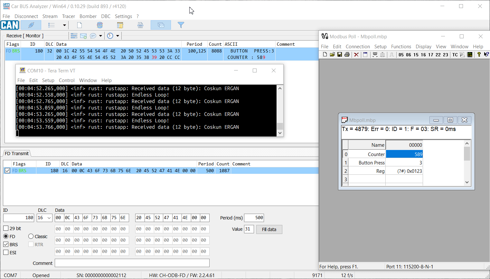
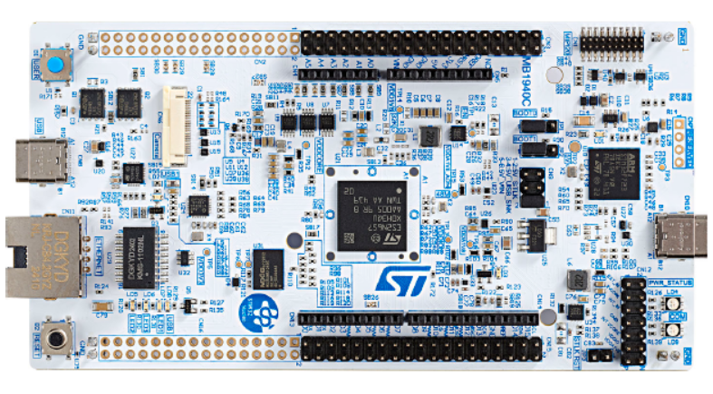

# Zephyr + Rust CANbus & ModBus Demo

<p align="center">
  
  <br/>
  <br/>
  
</p>

This repository contains a CANbus and ModBus communication demonstration project utilizing the **Zephyr RTOS** and the **Rust** programming language. The demo sets up a basic CANbus network and integrates the ModBus protocol, serving as an example for embedded systems development with a modern, memory-safe language.

---

## 🌟 Project Overview

This project showcases the implementation of a CANbus application using the Zephyr real-time operating system (RTOS) as the underlying framework. As is known, differentially operated communication channels are widely used in the automotive and industrial sectors. In this context, I have combined a robust communication interface like ModBus with the Rust language, which allows us to write reliable and safe code.

## 🛠️ Features

* **CANbus Communication:** Establishes a functional CANbus interface for sending and receiving standard CAN frames.
* **ModBus Integration:** Implements the ModBus protocol, a robust communication interface for automotive and industrial environments. This is achieved by using the Zephyr ModBus module.
* **Zephyr RTOS Integration:** Utilizes Zephyr's hardware abstraction layer (HAL) and drivers for seamless interaction with the STM32N657's CAN peripheral.
* **Rust on Embedded:** Demonstrates the use of the Rust ecosystem (Cargo, `no_std`, and specific crates) for bare-metal and RTOS-based embedded development.
* **Structured Project:** Follows a well-organized file structure to separate application logic, board configurations, and documentation.

---

## 🚀 Getting Started

To build and run this project, you need to set up your development environment for Zephyr and Rust for embedded systems.

### Prerequisites

* **Zephyr Development Environment:** Follow the official [Zephyr Getting Started Guide](https://docs.zephyrproject.org/latest/develop/getting_started/index.html) to install the Zephyr SDK and all necessary dependencies.
* **Rust Toolchain:** Install the Rust toolchain with `rustup`. Make sure to add the `thumbv7em-none-eabihf` target for the STM32 microcontroller:
    ```bash
    rustup target add thumbv7em-none-eabihf
    ```
* **Required Rust Crates:** The project uses specific Rust crates for the STM32 family and Zephyr integration. These are managed by `Cargo.toml`.

### Building the Project

1.  Clone this repository:
    ```bash
    git clone [https://github.com/coskunergan/zr_canbus_demo.git](https://github.com/coskunergan/zr_canbus_demo.git)
    cd zr_canbus_demo
    ```
2.  Build the project using Zephyr's build system, which is configured via CMake and Cargo:
    ```bash
    cargo build
    # Or for a release build
    cargo build --release
    ```

### Flashing the Microcontroller

After a successful build, you can flash the generated binary file to your STM32N657 board using a JTAG/SWD debugger (like an ST-Link). The final firmware file is typically located in `build/zephyr/zephyr.elf`.

---

## 📁 File Structure

* `src/`: Contains the main Rust application source code.
* `boards/`: Holds board-specific configuration files (DTS overlays, Kconfig fragments) if needed.
* `doc/`: Includes documentation and visual assets for the project.
* `build.rs`: A Rust build script used to generate a linker script and other necessary build artifacts from the Zephyr build system.
* `CMakeLists.txt`: Main CMake file for Zephyr's build process.
* `Cargo.toml`: Rust's manifest file, defining dependencies and project metadata.
* `prj.conf`: Zephyr's project-specific configuration file.

---

## 📝 License

This project is licensed under the MIT License. See the `LICENSE` file for details.